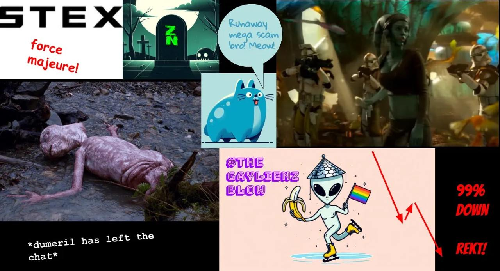

## Yet another marketing AZ without a funnel

> "If they deliver good work but are not funded, this undermines trust in the DAO and discourages future contributors, so the DAO is strongly incentivised to pay from the treasury fund to honour good work that has been done" @zyler9985

## Purpose
We are gathered here today 👇 to discuss the most prolific NoM writer since inception, second only to the founding developers: @zyler9985.

[Zenon Pillar Alliance](https://zenonhub.io/accelerator-z/project/4579f97807ce2458239c29b78fc01b797879827f489dcb6c16e33b37b411a773) & [Zenon Pillar Horde](https://zenonhub.io/accelerator-z/project/66849cea94d7fb1f76fc3288e24df02d0bf66a3c61cc3d9f1af4da780e88a9ca) have agreed to "pledge support for initiatives that drive awareness and adoption of Zenon’s technology and make the best use of AZ to fulfill the mission: reaching new galaxies with the message of Phase Z".  

🚨 It's time to do the needful.

## Background
Since Jan 2022, Zyler has written 40 articles on our project.  You can see them listed on [medium](https://medium.com/@Zyler9985).  The combined reading time of the articles is many hours and they must have taken him hundreds of hours to write.  The articles are accurate, easy to read, and show a breadth of knowledge.  The stories span many genres: storybooks, fictional novels, technical writing, guides, etc.  They were distributed on a reliable cadence and can serve as an onboarding vehicle for users and developers.  

In Short, Zyler delivered foundational knowledge to the community through engaging articles to onboard the next wave of aliens.  It our job to distribute them and use them to help grow the project.

## The Hypergrowth Problem

> "The current situation of the AZ fund paying zero for Hypergrowth is unacceptable."

> "You cannot rely only on altruistic, masochistic contributors — you may go a few steps forwards, but you won’t get far enough. And even if you do get far enough (you won’t) — it will take too long and either fiat will win or a rival BTC L2 will win. Either way, that means Zenon fails. So the entire culture, precedence and organisation of AZ for Hypergrowth needs to change."

Zyler made compelling arguements in his last article ["Why Zenon Is Going To Zero"](https://medium.com/@Zyler9985/why-zenon-is-going-to-zero-1fc2453c3e2a) for why we need to look beyond purely quantitative metrics to assess hypergrowth iniatives.  See **Problem #2: the community is paying zero for hypergrowth** in the article.

It's time to change.  
  
## AcceleratorZ

Zyler submitted an AZ called [Zenon Storybook AZ](https://zenonhub.io/accelerator-z/project/052ccc40000d677bc2c61dd9c7dac3bac5759b514b7604bd590a10d6efb0404b) asking for 5,000 $ZNN and 50,000 $QSR.  The description was: `For Zyler's articles and the storybook for marketing Zenon.`  The AZ was *rejected*.  

Let's be honest, the description sucked and he made no mention of the work involved.  Months later Brat and deeZNNutz started to reread the articles, starting with the `.pdf` [storybook](assets/pdf/The_Zenon_Storybook.pdf).  It's accurate, informative, comprehensive, and insightful. After digging through the `.pdf` we both read every article again, all 40 of them.  It took hours to to read them.  

All we can say is `wow`.  They are awesome.  Zyler laid out a roadmap for onboarding speculators, contributors, and developers.  There is something for everyone.  Zyler said early on that he needed help with distribution.  So here you go.  Brat and deeZ made a `greenpill` website to help new users understand the project by laying out a reading path using Zyler's articles.  More on that below.  

## A Second Chance

After re-reading all the articles written by @zyler it's clear to us this work deserves another shot at the AZ that got rejected.  

Brat & deeZ proposes the following:
- 5,000 $ZNN and 50,000 $QSR to Zyler for two years of work with includes 40 articles and one comprehensive `.pdf`
- If this AZ is approved, Brat & deeZ will send 5,000 $ZNN and 50,000 $QSR to The Sultan of Staking.  Sultain will hold the funds in escrow.  
- If AZ payment is approved, Brat & deeZ will receive 5,000 $ZNN and 50,000 $QSR, and the Sultain will release the escrowed funds to Zyler

The network needs writers to prevent a 'void' of content in our historical timeline. Almost certainly you have derived value from Zyler's articles if you are part of the Zenon culture. Sets the right precedence: the network pays when value is created.

## We ask for your support to approve this AZ and pay Zyler for the valueable work he created.  

> Despite my current absence, I still care about Zenon and always will. It pains me to see the network struggling. I hope the community can turn things around soon, and I believe they will if they come together. -Zyler9985

## Click the Green Pill

