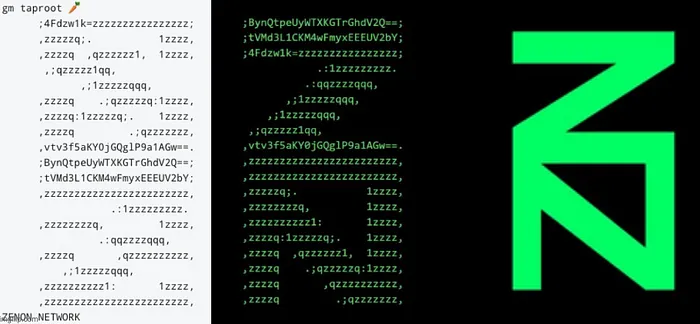

# What is Zenon Network?
[Zenon Network](https://zenon.network) is a "self-evolving planetary-scale digital ecosystem powered by a worldwide community of contributors. Its fundamentally disruptive protocol goes beyond the blockchain trilemma. Zenon proposes a blockchain that is secure, scalable, and achieves true decentralization".

Zenon Network maintains a community run website at [https://zenon.network](https://zenon.network).  Other community members maintain informational websites about the project, such as [zenon.info](https://zenon.info) and [zenon.org](https://www.youtube.com/watch?v=m4eF2YE3SJM).  
- `.info` is a community blog and should not be confused with Zenon Network.  
- `.org` is a venture backed entity that markets Zenon Network and develops closed source tooling for "performance marketing".  

```
Nothing in this website should be considered financial advice.
```

---

## Introduction
* This website serves as a roadmap for new users, contributors and developers to become familiar with Zenon Network. 
* Was Zenon designed by hardcore Bitcoin OGs? All signs point to YES, but DYOR.
* The founding developers and architects may or may not still be with us: DYOR.
* The community runs the project, in every respect.
* Moonboys beware.
* Jack is not going to save us, but if that interests you check out the [Moon Papers](https://znn.link/moonpapers).  They are autistic and probably wrong.    
* Expect to encounter developers and contributors who are not motivated by money or a localized pamp.  
* @Chadass (aka GigaWoke Capital) and his army of alts destroy the weak. Don't expect any sympathy.
* This roadmap is made possible by the tireless work of @zyler9985.  Thank you zir!
* We are looking for contributors, developers, and speculators to join the community.  But before you do, always remember 👇


---

## 🐇 The Rabbit Hole 🐇

> Henry David Thoreau once wrote: “It’s not what you look at, it’s what you see.” Looking at Zenon, I don’t see a remote resemblance to anything else in the crypto space. It’s totally alien. Definitely not an alt or sh*tcoin. It’s like Bitcoin, but a separate entity and in its atomic era. It’s a mystery inside a riddle that’s been wrapped on the enigma blockchain. It’s a blind painter’s masterpiece. It’s the inevitable crash-landing of alien tech. 
> 
> What do you see?
>
> @zyler9985

### Step 1: Introduction Video 
Watch this 👉 [Zenon Introduction Video](https://www.youtube.com/watch?v=UqAequz4mgk).  It will give you a high level outline of the project and its goals.  

### Step 2: [The Green Pill](https://medium.com/@Zyler9985/zenon-network-i-the-green-pill-883e608727a)

### Overview
Zenon Network is a new layer-1 cryptocurrency that launched its mainnet in November 2021. There are plans for apps, NFTs, interoperability, and DeFi with native Bitcoin. True decentralization is at its core, adhering closely to the Bitcoin ethos with an egalitarian launch—no presale, premine, VCs, or insider allocations, ensuring the same conditions for everyone through a public bond.

### Unique Tech
Zenon innovates with a dual-ledger system: a meta-DAG for consensus and a block-lattice for storing transactions. It employs two native coins to achieve equilibrium and plans to implement [Narwhal and Tusk](https://arxiv.org/pdf/2105.11827.pdf) for extreme scalability, making transactions feeless*. Zenon is feeless at the layer-1 level, requiring only a simple proof of work to send and receive transactions. For higher throughput, users can lock QSR to generate “plasma,” without spending QSR.

### Development
Developers are building two Layer 2 solutions: one EVM compatible for interoperability and another with cutting-edge technology for extreme scalability. Smart contracts will be hosted on these Layer 2s to maintain a minimalist and efficient base layer.

### Anon Team
The original core team remains anonymous, having passed the torch to the community, staying true to the Bitcoin ethos. There's speculation about Zenon's backing by OG Bitcoiners, but DYOR.

### Decentralization
Zenon's principled adherence to decentralization through its egalitarian launch and grassroots marketing ensures the network is owned and controlled by the people, not institutions.

### Bitcoin Integration
The network has ambitious plans for Bitcoin, leveraging the Taproot upgrade for new use-cases and aiming to integrate with Bitcoin via merged mining. This aligns with Zenon’s [whitepaper](https://znn.link/whitepaper), which envisions a hybrid of PoS and PoW.

**Native Coins:**
- **Zenon (ZNN):** Governance, 9M supply, 90M max supply
- **Quasar (QSR):** Gas*, 30M supply, 80M max supply

**Running a Node:**
- **Sentinel:** Requires 5k ZNN & 50k QSR
- **Pillar:** Requires 15k ZNN & 150k+ QSR

*Note: Feeless transactions on the base layer may still involve some costs or requirements, such as proof of work or QSR locking.

### Step 3: [Press Start 2P](https://medium.com/@Zyler9985/zenon-network-ii-press-start-2p-47847aa68645)
This article introduces Zenon's design for earning rewards through gamification

### Step 4: [Game Theory for Progressive Decentralisation](https://medium.com/@Zyler9985/zenon-network-iii-game-theory-for-progressive-decentralisation-38f94457b03e)
Building on the previous article, this piece explains how Zenon's design encourages decentralization over time.

> Interested in learning more?
> - [Putting the Z in Decentralization ](https://medium.com/@Zyler9985/putting-the-z-in-decentralization-7f40b33c87fc)

### Step 5: [Network Governance](https://medium.com/@Zyler9985/zenon-network-an-introduction-to-governance-953aec64fda)
An intro to Zenon governance.

> Interested in Learning More? 
> - [All Hail The Zenocracy!](https://medium.com/@Zyler9985/zenon-network-iv-all-hail-the-zenocracy-f785203d102b)

### Step 6: [8 Tips For Delegators](https://medium.com/@Zyler9985/zenon-network-v-8-tips-for-delegators-e0fb031d3f4b)
This articles helps with decision-making for who to delegate to, explains pillar metrics and other relevant considerations.

### Step 7: [Welcome To The Multiverse](https://medium.com/@Zyler9985/zenon-network-vi-welcome-to-the-multiverse-a7c1cbedc94c)
This piece introduces Zenon's interoperability features, expanding on its capabilities beyond its own network.

### Step 8: [8 Exciting Things Coming To Zenon](https://medium.com/@Zyler9985/zenon-network-vii-8-exciting-things-coming-to-zenon-ab09b59ac48d)
The title is self-explanatory!

### Step 9: [Alien Plans For Bitcoin](https://medium.com/@Zyler9985/zenon-network-viii-alien-plans-for-bitcoin-804e1ba60a3c)
A discussion of the roadmap, vision and strategy with specific focus on interoperability & DeFi with native Bitcoin. Is it just a coincidence that Zenon’s mainnet went live a few days after the Taproot upgrade, or that Zenon’s founders signed block 709632 with ASCII art?



> Interested in learning more? 
> - [Zenon Network: Merged Mining Bitcoin](https://medium.com/@Zyler9985/zenon-network-merged-mining-bitcoin-fb7ccf60161e)
> - [Zenon's Synergy with Nostr](https://medium.com/@Zyler9985/zenons-synergy-with-nostr-c36fe2bf955c)

### Step 10: [A Blistering Need For Speed](https://medium.com/@Zyler9985/zenon-network-a-blistering-need-for-speed-ce34246c2f01)
A breakdown of how all of Zenon’s characteristics are optimized for ultra scalability.

### Step 11: [Why Zenon Is Regulation-Proof](https://medium.com/@Zyler9985/why-zenon-is-regulation-proof-b696c3a03d0d)
Understanding how Zenon is "regulation proof".

### Step 12: [The Zenon Ethos](https://medium.com/@Zyler9985/the-zenon-ethos-4e0ab0dff12b)
We are an “awesome and hardcore bunch of retarded, autistic hyenas” with unmatched [determination](https://www.youtube.com/watch?v=cqA_vr3NQgE). We are deeply principled, irreverent, autistic, weird as hell and strong. If this sounds like you, join our cause.  If you are a moon boy looking for a pump, I wish you luck.    

### Step 13: [A timeline piece](./assets/pdf/concise-overview-of-zenon-network.pdf)
Zenon’s early history as a crypto storybook. This is a comprehensive `.pdf` that tells the complete Zenon Network Story. It will bring together everything you have learned from the steps above.  

### Step 14: Fantasy Time
Fact or fiction?  Maybe a little of both. Did Vitalik try to kill Zenon when he heard about it? 👇
- [A Noir Story](https://medium.com/@Zyler9985/zenon-network-a-noir-story-a06cc8945439)
- [A Zenocracy in Peril](https://medium.com/@Zyler9985/zenon-network-a-zenocracy-in-peril-a9566991b455)

### Step 15: FUD
"The bigger we get, the bigger the FUD will be."
- [FUD Shield](https://medium.com/@Zyler9985/zenons-anti-fud-shield-aaa53210eba9)
- [Is Zenon going to $0?](https://medium.com/@Zyler9985/why-zenon-is-going-to-zero-1fc2453c3e2a)

---

### Additional Resources: 

#### Project Updates
- [2024 Q2 Update](https://www.atsocy.com/zenon-network-quarterly-update-q2-2024)

#### Introduction Articles
- [Zenon 101](https://medium.com/@Zyler9985/zenon-forum-nom-101-569e0dac4f8a)
- [A concise overview of Zenon](https://medium.com/@Zyler9985/a-concise-overview-of-zenon-aa72ba4dfffd)
- [An Alien's Thesis for Zenon Network](https://medium.com/@Zyler9985/an-aliens-thesis-for-zenon-network-97f46c49a13a)
- [Hello this is Zenon](https://medium.com/@Zyler9985/hello-this-is-zenon-9adbdb39ef6c)
- [What is Zenon Network?](https://blog.zenon.info/what-is-zenon-network/)
- [FAQs for Beginners](https://medium.com/@Zyler9985/zenon-network-faqs-for-beginners-d0df6d8d7476)

#### Supporting Articles
- [NFTs on Zenon](https://medium.com/@Zyler9985/the-power-of-nfts-on-zenon-c1c777c76106)
- [Forget Web3](https://medium.com/@Zyler9985/forget-web3-its-time-for-zenon-b7fedbf2ae2f)


#### How To Articles
- [A Guide for AZ Proposals](https://medium.com/@Zyler9985/simple-guideline-for-az-proposals-94621c80f257)
- [How to Apply for a Funding Grant](https://medium.com/@Zyler9985/zenon-network-how-to-apply-for-a-funding-grant-e977b7efce0d)
- [How to Buy $ZNN and Store it in the s y r i u s wallet](https://medium.com/@Zyler9985/longer-version-how-to-buy-znn-and-store-it-in-the-syrius-wallet-e197233ccb24)
- [A Strategy Guide for Rewards](https://medium.com/@Zyler9985/zenon-network-strategy-guide-for-rewards-1df807587898)

